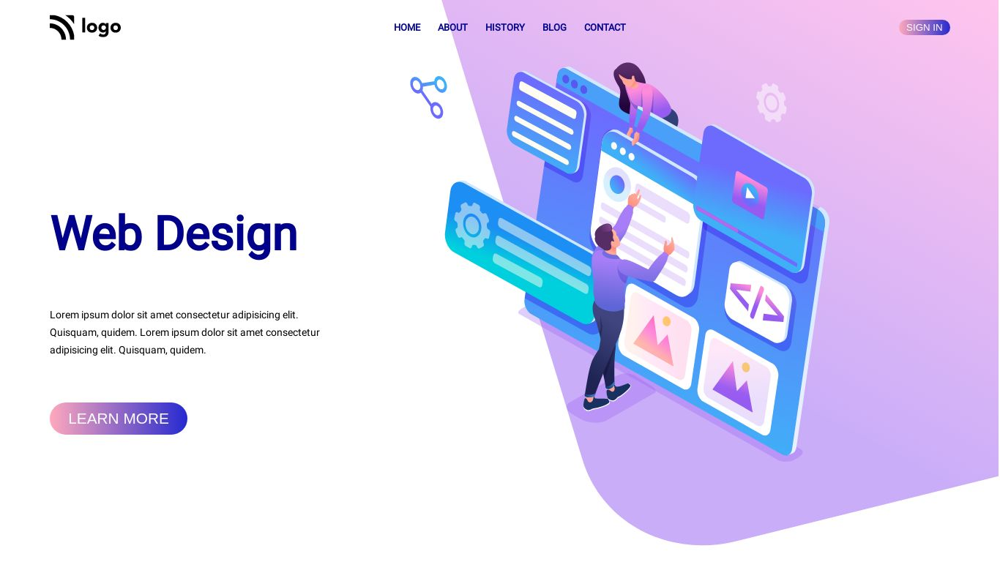
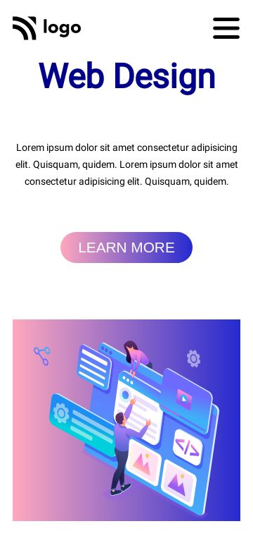

# Design Landing Page

> ## [Ashutosh Singh]()

 

## Tech Stack:

---

### Checkout the live website [here](https://web-design-landing-page-phi.vercel.app/).

---

## My Learnings

- Learned about Flex Box in CSS.
- Get better understanding of position by working on this project.
- Learned about Media Query.
- Learned about difference between rem and pexels.

## How the website looks like

 

### Desktop View :

 

### Mobile View :

 

